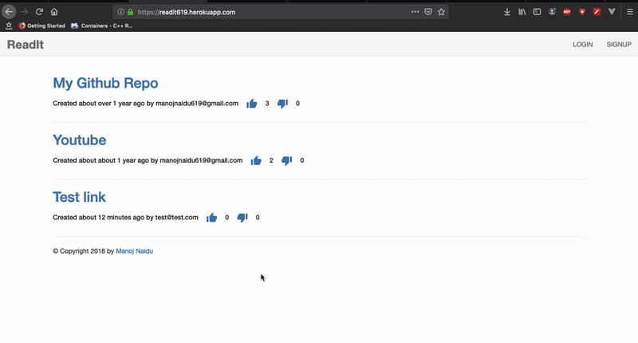

# Read-it [](https://readit619.herokuapp.com/) [](https://readit619.herokuapp.com/)




Things you may want to do before getting started:

* clone this repo: https://github.com/manojnaidu619/Read-It.git

* Or download the ZIP file

* cd to this folder in the Terminal

* Make sure to run below in the terminal
  ```sh
   rake db:migrate
  ```

* Start the rails server by typing below command in the terminal
  ```sh
   rails server
  ```
